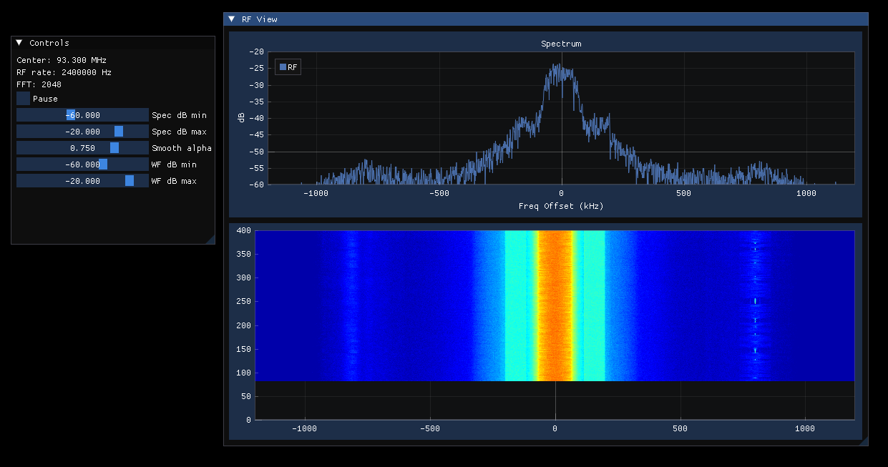
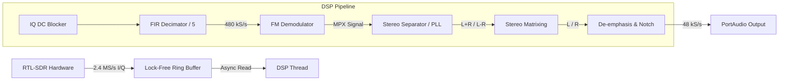

# RTL-SDR FM Radio

A real-time, multi-threaded Software Defined Radio (SDR) receiver written in C++20. 

This project implements a complete Digital Signal Processing (DSP) pipeline that interfaces with RTL-SDR hardware to demodulate FM Broadcast signals. It features a custom Stereo Decoder, real-time Spectral Analysis, and a lock-free double-buffered architecture for high-throughput processing.

<p align="center">
  
</p>

## Core Features

* **Advanced DSP Architecture:**
    * **Stereo Decoding:** Full MPX decoding using a Phase Locked Loop (PLL) to lock onto the 19kHz pilot tone and regenerate the 38kHz stereo subcarrier.
    * **Signal Processing:** Custom FIR Polyphase decimators, IIR De-emphasis filters, Pilot Notch filters, and DC blocking.
    * **Spectral Analysis:** Integrated **FFTW3** for real-time frequency domain visualization (Visualizer buffer implemented).
* **System Architecture:**
    * **Concurrency:** Distinc threads for Data Acquisition, Signal Processing, and Visualization.
    * **Communication:** Uses `std::atomic` lock-free ring buffers to pass 2.4 MS/s I/Q data between threads.
    * **Modern C++:** Utilizes C++20 standards (Templates, Atomics, Smart Pointers).
* **Testing & CI:**
    * **Automated Verification:** GitHub Actions pipeline runs integration tests on every commit.
    * **Hardware Simulation:** Validates signal integrity (SNR) and filter logic using pre-recorded raw RF samples. 

## DSP Pipeline Architecture




## Dependencies

The following libraries are handled automatically by `vcpkg`:
* **librtlsdr** (SDR hardware driver)
* **portaudio** (Audio I/O)
* **FFTW3** (Fastest Fourier Transform in the West)

### Prerequisites

1.  **Hardware:** An RTL-SDR USB Dongle.
2.  **Drivers (Windows):** You must install the WinUSB driver for your dongle using **Zadig**.
3.  **Build Tools:**
    * Visual Studio 2019 or 2022 (with "Desktop development with C++" workload).
    * [CMake](https://cmake.org/download/).
    * [Vcpkg](https://github.com/microsoft/vcpkg).

## Building the Project

### Environment Setup
Ensure the `VCPKG_ROOT` environment variable is set in Windows to your vcpkg installation path.

### 1. VS Code Workflow (Recommended)
This project is configured with `CMakePresets.json` for seamless VS Code integration.

1.  Open the project folder in **VS Code**.
2.  Install the **CMake Tools** extension (Microsoft).
3.  The extension should detect the presets. In the **CMake Side Bar** (or Status Bar):
    * **Configure Preset:** Select `win-release` (Windows Release VS 2019).
    * **Build Preset:** Select `Release Build` (Essential for real-time audio performance).
4.  Press **F7** or click **Build**.

### 2. Command Line (CLI)
You can also build from a PowerShell terminal using CMake directly:

```powershell
# Configure (uses vcpkg toolchain automatically via preset)
cmake --preset win-release

# Build (Explicitly specify Release config)
cmake --build build --config Release
```

## Usage

To start live streaming from the radio:
```powershell
./build/Release/FM_Radio.exe --stream
```

To record raw IQ data samples for testing (press ctrl+C to stop):
```powershell
./build/Release/FM_Radio.exe --record
```

To write to an audio (.wav) file:
```powershell
./build/Release/FM_Radio.exe
```

